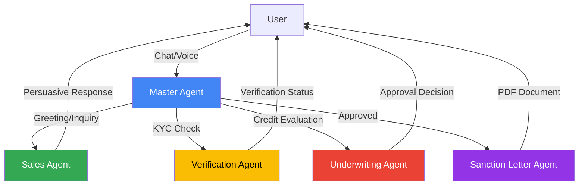
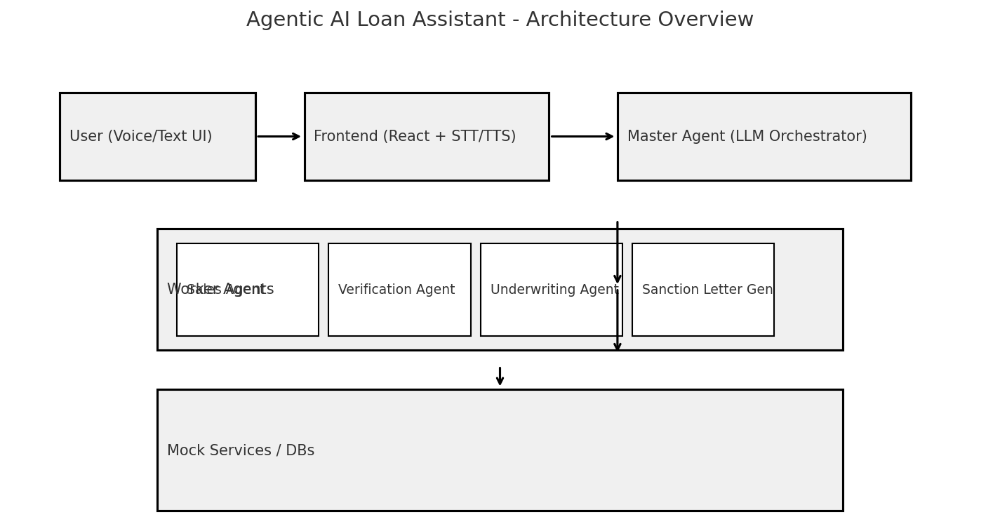

# 🤖 Agentic AI Loan Assistant

> An intelligent, AI-powered loan management system featuring multi-agent orchestration, voice authentication, and real-time mood detection.

[](https://nextjs.org/)
[](https://fastapi.tiangolo.com/)
[](https://ai.google.dev/)
[](https://www.typescriptlang.org/)
[](https://www.python.org/)

---

## 🌟 Features

### 🎯 Core Capabilities
- **Multi-Agent Orchestration** - Master agent coordinates Sales, Verification, Underwriting, and Sanction Letter agents
- **AI-Powered Conversations** - Google Gemini integration with intelligent fallback mechanisms
- **Voice Recognition** - Real-time speech-to-text using Web Speech API
- **Voice Authentication** - Secure voice biometric enrollment and verification
- **Mood Detection** - Real-time emotional analysis with adaptive responses
- **Credit Score Visualization** - Interactive gauge with color-coded ranges
- **Loan Calculator** - Real-time EMI calculations with tenure selection
- **Smart Intent Detection** - Context-aware conversation understanding
- **Session Management** - Persistent conversation history and context

### 🎨 UI/UX Highlights
- Modern glassmorphism design with gradient backgrounds
- Smooth animations and transitions
- Responsive layout for all screen sizes
- Real-time typing indicators
- Visual mood indicators
- Interactive voice waveform animations

---

## 🏗️ Architecture

### Multi-Agent System



### Technology Stack

#### Frontend
- **Framework:** Next.js 14.2.33 with TypeScript
- **UI Components:** Custom React components with glassmorphism
- **Voice:** Web Speech API for voice recognition
- **Styling:** Modern CSS with gradients and animations

#### Backend
- **Framework:** FastAPI (Python)
- **AI/ML:** Google Gemini API with multi-tier fallback
- **Session:** In-memory session management
- **Documents:** ReportLab for PDF generation

---

## 🚀 Quick Start

### Prerequisites
- **Node.js** 18+ and npm
- **Python** 3.8+
- **Google Gemini API Key** (Free from [Google AI Studio](https://aistudio.google.com/app/apikey))
- **RapidAPI Key** (Optional, for fallback)

### Installation

1. **Clone the repository**
```bash
git clone https://github.com/yourusername/Agentic-AI-Loan-Assistant.git
cd Agentic-AI-Loan-Assistant
```

2. **Set up environment variables**
```bash
# Create .env file in the root directory
cp .env.example .env

# Edit .env and add your API keys
GOOGLE_GEMINI_API_KEY="your-gemini-api-key"
RAPIDAPI_KEY="your-rapidapi-key"  # Optional
```

3. **Install backend dependencies**
```bash
pip install -r agentic_loan_assistant/backend/requirements.txt
```

4. **Install frontend dependencies**
```bash
cd agentic_loan_assistant/frontend
npm install
cd ../..
```

### Running the Application

#### Option 1: Automated Start (Windows)
```powershell
.\agentic_loan_assistant\start_with_api_key.ps1
```

#### Option 2: Manual Start

**Terminal 1 - Backend:**
```bash
python -m uvicorn agentic_loan_assistant.backend.main:app --reload --host 0.0.0.0 --port 8000
```

**Terminal 2 - Frontend:**
```bash
cd agentic_loan_assistant/frontend
npm run dev
```

### Access the Application
- **Frontend:** http://localhost:8080
- **Backend API Docs:** http://localhost:8000/docs
- **Backend Health:** http://localhost:8000

---

## 📖 Usage

### Basic Conversation Flow

1. **Enter Customer ID** (e.g., `cust004`)
2. **Start a conversation** via text or voice:
   - "Hello, I need a loan"
   - "What's my pre-approved limit?"
   - "I want to borrow 100000"
3. **System responds** with multi-agent orchestration
4. **Get instant approval** or alternative offers

### Sample Customer IDs
- `cust001` - High credit score (850)
- `cust004` - Good credit score (720)
- `cust007` - Fair credit score (650)

---

## 🎯 API Endpoints

### Master Chat
```http
POST /master/chat
Content-Type: application/json

{
  "customer_id": "cust004",
  "message": "I need a loan of 100000",
  "requested_amount": 100000,
  "tenure_months": 60
}
```

### Authentication
- `POST /auth/generate-otp` - Generate OTP
- `POST /auth/verify-otp` - Verify OTP
- `POST /auth/enroll-voice` - Enroll voice biometric
- `POST /auth/verify-voice` - Verify voice biometric

### Customer Data
- `GET /mock/crm/{customer_id}` - Get customer KYC
- `GET /mock/offermart/{customer_id}` - Get loan offers
- `GET /mock/credit/{customer_id}` - Get credit score

### Documents
- `POST /upload/salary-slip` - Upload salary slip
- `GET /sanction/{customer_id}` - Download sanction letter PDF

---

## 🧠 AI Features

### Intent Detection
The system detects the following intents:
- **Greeting** - Hello, Hi, Good morning
- **Check Limit** - What's my limit? How much can I borrow?
- **Loan Inquiry** - I need a loan, want to borrow money
- **Apply Loan** - Apply for loan, get loan
- **Check Status** - What's my status? Track application
- **Affirmative** - Yes, OK, Sure, Proceed
- **Negative** - No, Not interested, Maybe later
- **General** - Other questions

### Mood Detection
Real-time emotional analysis:
- 😊 **Happy** - Enthusiastic, positive responses
- 😤 **Frustrated** - Empathetic, quick resolution
- 😰 **Anxious** - Reassuring, patient explanations
- 😕 **Confused** - Clear, step-by-step guidance
- 😐 **Neutral** - Professional, friendly tone

### Fallback System
**3-Tier AI Fallback:**
1. Google Gemini (Official API - FREE)
2. RapidAPI Gemini
3. DeepSeek
4. Intelligent keyword-based responses

**System never fails** - Always provides a response!

---

## 📁 Project Structure

```
Agentic-AI-Loan-Assistant/
├── .env                              # Environment variables (DO NOT COMMIT)
├── .gitignore                        # Git ignore rules
├── README.md                         # This file
│
└── agentic_loan_assistant/
    ├── backend/                      # FastAPI backend
    │   ├── main.py                   # Main API endpoints
    │   ├── llm_orchestrator.py       # AI orchestration
    │   ├── underwriter.py            # Loan underwriting logic
    │   ├── auth.py                   # Authentication
    │   ├── session_manager.py        # Session management
    │   ├── google_gemini_client.py   # Gemini API client
    │   ├── api_clients.py            # Fallback API clients
    │   ├── utils.py                  # Utility functions
    │   └── requirements.txt          # Python dependencies
    │
    ├── frontend/                     # Next.js frontend
    │   ├── app/
    │   │   ├── page.tsx              # Main page
    │   │   ├── layout.tsx            # Layout
    │   │   └── globals.css           # Global styles
    │   ├── components/
    │   │   ├── CreditScoreGauge.tsx  # Credit score visualization
    │   │   ├── LoanCalculator.tsx    # EMI calculator
    │   │   ├── MoodIndicator.tsx     # Mood display
    │   │   └── VoiceAuth.tsx         # Voice authentication
    │   └── package.json              # Node dependencies
    │
    ├── data/
    │   └── customers.json            # Mock customer data
    │
    ├── tests/                        # Test files
    ├── scripts/                      # Utility scripts
    └── start_with_api_key.ps1        # Windows startup script
```

---

## 🔒 Security

### Important Notes
- **Never commit `.env` files** - Contains sensitive API keys
- **Rotate API keys** if accidentally exposed
- **Use HTTPS** in production
- **Implement proper authentication** for production use
- **Secure session storage** with encryption

### Production Checklist
- [ ] Replace mock authentication with real OAuth/JWT
- [ ] Add rate limiting
- [ ] Implement proper database with encryption
- [ ] Enable HTTPS/SSL
- [ ] Add API key rotation
- [ ] Implement audit logging
- [ ] Add input validation and sanitization

---

## 🧪 Testing

### Run Backend Tests
```bash
pip install pytest requests
pytest tests/
```

### Run Demo Script
```bash
python scripts/demo_flow.py
```

---

## 🎨 Screenshots

### Main Interface


### Features
- Interactive loan calculator with real-time EMI
- Credit score gauge with color-coded ranges
- Voice authentication with waveform visualization
- Mood-aware responses with emoji indicators

---

## 🛠️ Development

### Adding New Agents
1. Create agent logic in `backend/main.py`
2. Add agent personality in `llm_orchestrator.py`
3. Update orchestration flow in master agent

### Customizing UI
- Edit components in `frontend/components/`
- Modify styles in `frontend/app/globals.css`
- Update page layout in `frontend/app/page.tsx`

---

## 📝 Environment Variables

Create a `.env` file in the root directory:

```bash
# Required
GOOGLE_GEMINI_API_KEY="your-gemini-api-key-here"

# Optional (for fallback)
RAPIDAPI_KEY="your-rapidapi-key-here"
```

---

## 🤝 Contributing

Contributions are welcome! Please follow these steps:

1. Fork the repository
2. Create a feature branch (`git checkout -b feature/amazing-feature`)
3. Commit your changes (`git commit -m 'Add amazing feature'`)
4. Push to the branch (`git push origin feature/amazing-feature`)
5. Open a Pull Request

---

## 📄 License

This project is licensed under the MIT License - see the LICENSE file for details.

---

## 🙏 Acknowledgments

- **Google Gemini** for powerful AI capabilities
- **FastAPI** for excellent API framework
- **Next.js** for modern React framework
- **Web Speech API** for voice recognition

---

## 📞 Support

For questions or issues:
- Open an issue on GitHub
- Contact: your.email@example.com

---

## 🚀 Roadmap

- [ ] Add multi-language support
- [ ] Implement real-time notifications
- [ ] Add document OCR for salary slips
- [ ] Mobile app (React Native)
- [ ] Advanced analytics dashboard
- [ ] Integration with real banking APIs
- [ ] Blockchain-based document verification

---

**Made with ❤️ using AI and modern web technologies**

⭐ Star this repo if you find it helpful!
